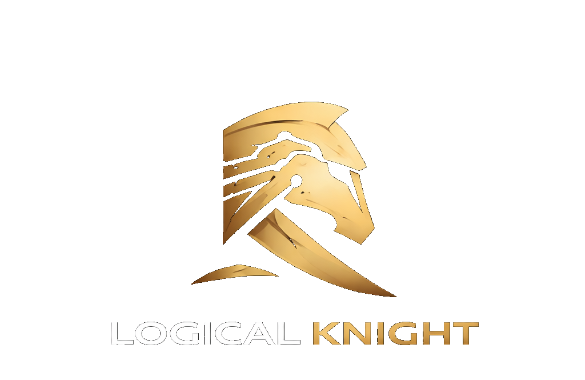

  

# Logical Knight

Logical Knight builds practical technology for difficult real-world problems.

We develop focused software, AI, automation and data products where existing workflows are manual, fragmented, expensive or inadequate.

## What we do

We identify real operational problems, understand the workflow, build focused solutions and validate them with real users.

## Agent Research

Agent Research is a Logical Knight product currently in **Early Access**.

It monitors public sources, detects meaningful business changes, verifies them against original evidence and delivers structured events for people and software systems.

Key public capabilities:

- Evidence-backed business events
- Multilingual monitoring
- Source provenance
- API and webhook delivery
- Machine-to-machine payment support (in development)

More products are currently in private development.

## Contact

- Website: [logicalknight.com](https://logicalknight.com)
- Email: [logicalknight0@gmail.com](mailto:logicalknight0@gmail.com)
